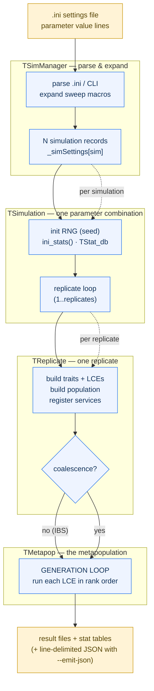
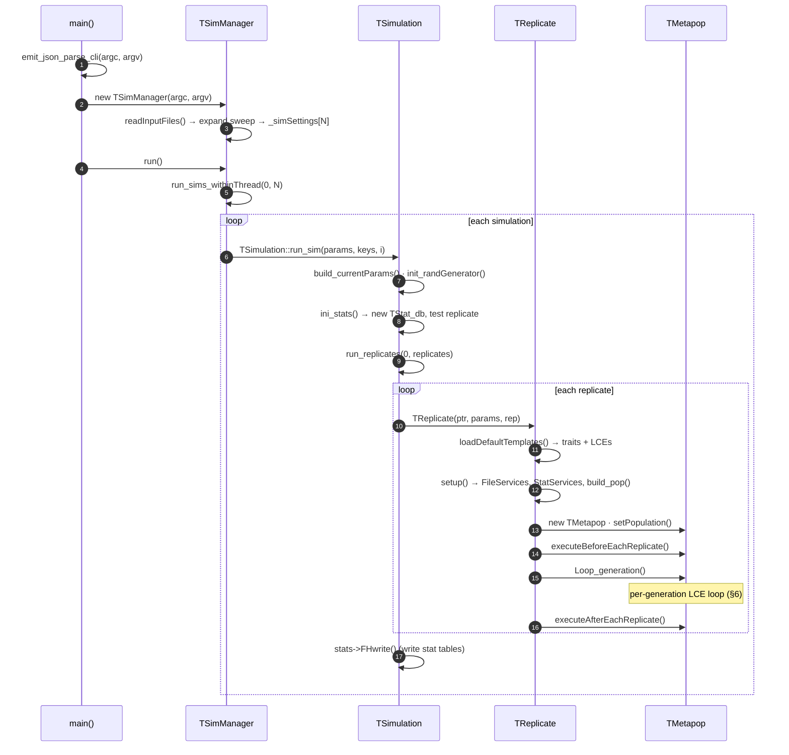
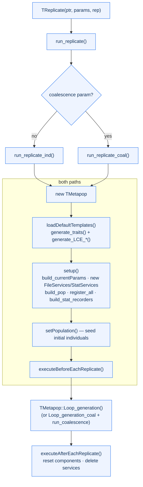
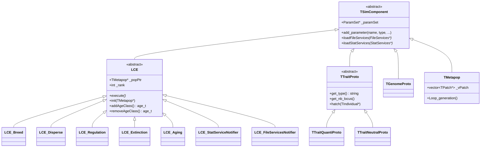
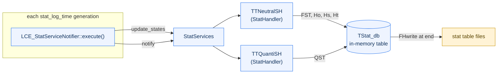
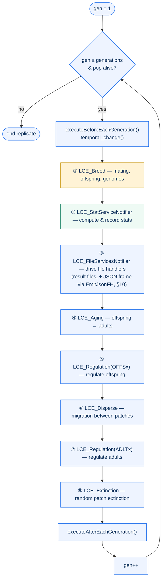
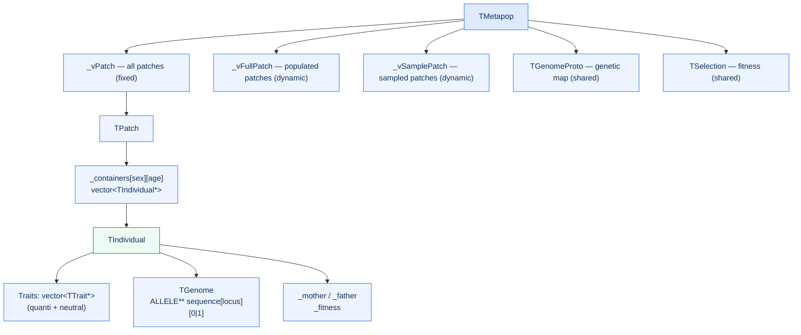
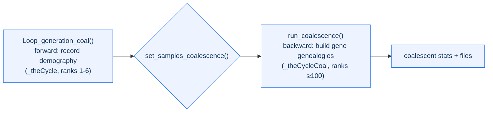
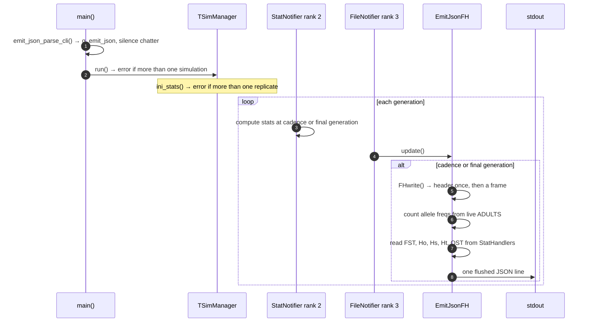

# quantiNemo 2 — C++ Engine Developer Guide

An architectural map of the simulation engine: the run hierarchy, the NEMO-derived
component framework, the per-generation life cycle, and the `--emit-json` machine-readable
output mode.

> **⚠️ AI-generated.** This guide was produced by an AI assistant (Claude) from a read of
> the source on `master`. It is a navigational aid, not an authoritative spec — verify
> against the code before relying on any detail, and treat the source as the source of
> truth.
>
> **Audience:** C++ developers working in `engine/quantinemo`.
> Diagrams are Mermaid and render natively on GitHub.

## Contents

1. [What this engine is](#1-what-this-engine-is)
2. [Build & run](#2-build--run)
3. [The big picture](#3-the-big-picture)
4. [Run hierarchy in detail](#4-run-hierarchy-in-detail)
5. [The component framework](#5-the-component-framework-nemo-derived)
6. [The generation loop](#6-the-generation-loop-heart-of-the-engine)
7. [Population data model](#7-population-data-model)
8. [Statistics — layer 1](#8-statistics--the-layer-1-estimators)
9. [Coalescent mode](#9-coalescent-mode)
10. [JSON output mode (`--emit-json`)](#10-json-output-mode---emit-json)
11. [Vendored numerics](#11-vendored-numerics--do-not-refactor)
12. [File index](#12-file-index-where-to-look)
13. [Conventions & gotchas](#13-conventions--gotchas)

---

## 1. What this engine is

quantiNemo 2 is an **individual-based, genetically explicit, stochastic** simulation
program for population and quantitative genetics (C++11, GPLv3). It models **selection,
mutation, recombination and drift** on quantitative traits and neutral markers, in
structured populations (patches) connected by migration. It is built on the NEMO
evolutionary-genetics framework (Guillaume & Rougemont, 2006) and can run in two engines:

- **Individual-based (IBS)** — every individual carries an explicit genome; the full life
  cycle is simulated each generation.
- **Coalescent** — a faster, backward-in-time mode that records demography forward, then
  builds gene genealogies (no quantitative traits allowed).

The program reads a flat `.ini` of `parameter value` lines, runs the simulation(s), and
writes result files plus statistics tables.

> **Driving the engine programmatically.** Beyond the file-based workflow, the engine can be
> run at **single-run granularity** (one invocation = one simulation, one replicate) with the
> `--emit-json` flag, which streams **line-delimited JSON** to stdout at each logged
> generation (§10). This makes the engine easy to embed: the Python API (`pyquantinemo`) is
> the primary consumer — it builds the `.ini`, runs the binary, parses the stream, and
> aggregates across replicates — but the same line-delimited output suits notebooks, CLI
> pipelines, or any other driver. The within-replicate genetic estimators (FST, QST,
> heterozygosities — "layer 1") stay in C++; across-replicate aggregation (means, variances,
> CIs — "layer 2") is left to the caller (e.g. Python).

---

## 2. Build & run

The canonical build is the `Makefile` (a `CMakeLists.txt` also exists). The binary is
written to `bin/quantinemo`.

```sh
make            # release build (-O3), stamps git version (default target)
make debug      # adds -D_DEBUG and -Wall (debug symbols, memory-cleanup checks)
make thread     # release build with -D_THREAD (multithreaded sweep)
make profile    # adds -pg for gprof
make clean      # removes src/*.o
```

- Requires C++11 (`-std=c++11`); `g++` by default.
- Upstream `release` uses `-static`, which may not link on macOS — drop it locally (or use
  `make static` as opt-in on the build-system cleanup branch).
- `make` always `touch`es `src/tsim_manager.cpp` so the embedded git version (`VERSIONGIT`
  from `git describe`) and compile timestamp stay current.
- `-w` suppresses warnings on object compilation; use `make debug` to see them.

```sh
bin/quantinemo                 # prompt for a settings file
bin/quantinemo settings.ini    # run the simulation(s) defined in the .ini
bin/quantinemo --generations 5000 ...   # parameters passed directly
bin/quantinemo --help [param]  # usage + parameter help; --version for version
bin/quantinemo --emit-json settings.ini    # line-delimited JSON output mode (§10)
```

> There is **no test suite** in this repo. Validate changes by running against `.ini`
> configs and diffing the output files / stat tables.

---

## 3. The big picture

A single `.ini` can describe *many* simulations (via the sequential "sweep" syntax), each
with many replicates, each advancing a metapopulation generation by generation. The control
flow is therefore a **four-level nesting** of objects, wrapping the per-generation
life-cycle loop at the centre.



*The four nested levels. Each outer box loops over the inner one; the innermost box (the
generation loop) is where the simulation actually advances.*

| Level | Class / file | Loops over | Responsibility |
|------|--------------|-----------|----------------|
| 0 | `main` · `main.cpp` | — | Entry point, exception handling, CLI pre-parse. |
| 1 | `TSimManager` · `tsim_manager.cpp` | simulations | Parse `.ini`/CLI, expand sweep into N records, allocate threads. |
| 2 | `TSimulation` · `tsimulation.cpp` | replicates | One parameter combination; seed RNG, set up stats/files, loop replicates. |
| 3 | `TReplicate` · `treplicate.cpp` | — | Build pop + traits + LCEs, register services, dispatch IBS vs coalescent. |
| 4 | `TMetapop` · `tmetapop.cpp` | generations | Holds patches/individuals; runs the per-generation life-cycle loop. |

---

## 4. Run hierarchy in detail



*End-to-end call sequence for an individual-based run.*

### 4.1 `main` — `main.cpp`

A thin entry point. It sets the global verbosity flags (`verbose_message`,
`verbose_warning`, `verbose_error`, declared here), runs `emit_json_parse_cli()` to
detect/strip the `--emit-json` flag *before* the parser sees `argv`, constructs
`TSimManager`, and calls `run()`. Everything is wrapped in nested try/catch: errors are
signalled by **throwing** (an `int`, a `const char*`, or `bad_alloc`) and caught here; the
process exit code is `returnVal`.

### 4.2 `TSimManager` — parse & expand

Reads the `.ini`/CLI into one or more **parameter records**. A single `.ini` can expand into
many simulations via the sequential-parameter *sweep* syntax (parameter ranges, `rep()`
macros, `set` keywords) — handled by `build_records_full()` / `build_records_reduced()`. The
result is two parallel vectors of maps:

```cpp
vector<map<string,string>> _simSettings;  // _simSettings[sim][param] = arg
vector<map<string,string>> _keyParams;    // _keyParams[sim][keyword] = arg
unsigned int _nbSims;                       // number of expanded simulations
```

`run()` calls the free function `run_sims_withinThread(this, 0, _nbSims, …)`, which
constructs one `TSimulation` per record and calls `run_sim()`. (`get_nbThreads()` currently
returns `1` — threading is stubbed.)

> With `--emit-json`, `run()` errors out up front if `_nbSims > 1` — the caller (e.g. the
> Python API) must drive sweeps itself so it always knows which run produced the output.

### 4.3 `TSimulation` — one parameter combination

`run_sim()` performs the per-simulation setup, in order:

1. `build_allParams()` / `build_currentParams()` — materialise the `ParamSet`s for this combination.
2. `init_randGenerator()` — read the `seed` parameter (or a time seed) and create one `RAND` engine per thread (`randEngines[]`).
3. `ini_stats()` — read `replicates`, construct the `TStat_db` statistics database, and run a *test replicate* (`test_replicate_and_setUpStats()`) that builds a throw-away metapop to validate every parameter and discover which stats/files will be produced.
4. `run_replicates(this, …, 0, _replicates, …)` — the replicate loop; constructs one `TReplicate` per replicate (its constructor runs the replicate).
5. `stats->FHwrite()` — flush the aggregated stat tables to disk; then run any post-exec script and write the log.

> With `--emit-json`, `ini_stats()` errors if `replicates > 1`, so the loop runs exactly one replicate.

### 4.4 `TReplicate` — one replicate

`TReplicate` derives from `SimBuilder` (`basicsimulation.h`), which owns the lists of *trait
templates* and *LCE templates* and knows how to clone the ones requested by the `.ini`. Its
constructor calls `run_replicate()`, which branches on `isCoalescence()`:



*Inside one replicate. `loadDefaultTemplates()` chooses the trait set and the LCE set;
`setup()` wires services and stat recorders.*

**Template generation** (`generate_traits()` / `generate_LCE_individual()`):

- **Traits** are added from the `.ini`: `TTraitQuantiProto` for quantitative traits,
  `TTraitNeutralProto` for neutral markers (one prototype per trait; `quanti_nb_trait` /
  `ntrl_nb_trait` can request several).
- **LCEs** for the IBS engine are added with fixed default ranks (see §6).

### 4.5 `TMetapop` — the metapopulation

`TMetapop` (≈3k lines, `tmetapop.cpp`) is the metapopulation itself. It multiply-inherits
`TSimComponent` (so it is configurable) and `IndFactory` (so it can manufacture individuals
from the registered trait prototypes). It owns the patch vectors, the genome prototype, the
selection object, the service pointers, and the generation counters — and it runs the
life-cycle loop (`Loop_generation()`, §6). The data model it holds is detailed in §7.

---

## 5. The component framework (NEMO-derived)

Almost everything configurable in quantiNemo is a **TSimComponent**: the metapopulation,
every trait, every life-cycle event, the genome. A component declares its parameters and
knows how to register the files and statistics it produces. This is the seam that lets the
`.ini` drive arbitrary combinations of operators.



*The `TSimComponent` hierarchy. LCEs and trait prototypes are the two big families;
`TMetapop` is itself a component (and also inherits `IndFactory`).*

### 5.1 `TSimComponent` — `simcomponent.h`

Base class for anything configurable. Subclasses:

- declare parameters in their constructor via `add_parameter(name, type, isRequired, min, max, default, …)`;
- implement the two pure-virtual hooks `loadFileServices(FileServices*)` and
  `loadStatServices(StatServices*)` to register output writers and stat recorders.

Each component owns a `ParamSet*` holding its parsed values.

### 5.2 `Param` / `ParamSet` — `param.cpp`

`Param` holds one parsed parameter (type, bounds, default, whether it is set, and the raw +
evaluated value); `ParamSet` is the named bag of `Param`s belonging to one component (e.g.
the set named `"quanti"` or `"breed"`). The `.ini` parameter names map onto these sets.
`param.cpp` (~2.6k lines) also handles matrix/array parameter syntax (`{…}`) and macro
evaluation.

### 5.3 Life-Cycle Events (LCE) — `lifecycleevent.h`, `lce_*.cpp`

An LCE is a population operator run once per generation. Each LCE has a **rank** (set by the
value of its `name` parameter in the `.ini`) that fixes its position in the generation loop
— only one operator per rank. The key virtual is `execute()`; `init(TMetapop*)` wires the
population pointer and trait links. Two methods, `addAgeClass()` and `removeAgeClass()`,
declare how the LCE shifts the population's *age state* (a bitmask the loop maintains — §6).

| LCE | File | What it does |
|-----|------|--------------|
| `LCE_Breed` | `lce_breed.cpp` | Mating + reproduction: pairs adults per the mating system, creates offspring, fills their genomes (recombination + mutation via the genome prototype). |
| `LCE_Aging` | `lce_misc.cpp` | Promotes age classes (offspring → adults), kills the old adults. |
| `LCE_Regulation` | `lce_regulation.cpp` | Down-regulates population size to carrying capacity (applied to offspring and again to adults). |
| `LCE_Disperse` | `lce_disperse.cpp` | Migration between patches per the dispersal model/rate (island, stepping-stone, custom matrix). |
| `LCE_Extinction` | `lce_extinction.cpp` | Randomly extincts patches per the extinction rate / survival rate. |
| `LCE_StatServiceNotifier` | `lce_misc.cpp` | At each `stat_log_time`, triggers stat computation & recording. |
| `LCE_FileServicesNotifier` | `lce_misc.cpp` | Each generation, drives all registered file handlers (result-file writers, genotypes, and — with `--emit-json` — the JSON emitter `EmitJsonFH`, §10). |
| `LCE_*Coalescence*` | `lce_coalescence*.cpp` | Coalescent variants of breed/disperse plus genealogy construction (§9). |

### 5.4 Traits & genome — `ttrait.h`, `ttquanti`, `ttneutral`, `tgenome`

A **trait prototype** (`TTraitProto` subclass) describes a trait shared by all individuals;
each individual carries a per-instance `TTrait`. Two concrete families:

- **`ttneutral`** — neutral markers; `get_value()` exposes raw allelic state. Used for FST /
  heterozygosity.
- **`ttquanti`** (~3.7k lines) — quantitative traits: maps genotype → genotypic value →
  **phenotype** (adding environmental variance per `quanti_heritability`), and is the
  substrate for stabilising selection. Exposes `get_phenotype()`, `get_genotype()`; used for
  QST.

`TGenome` (`tgenome.cpp`) holds the per-individual `ALLELE** sequence`
(`sequence[locus][0|1]` — allele 0 from the mother, allele 1 from the father) and implements
`recombine()` and `mutate()`. `TGenomeProto` holds the genetic map (locus positions, QTL vs
marker layout, recombination factors) shared by all genomes.

### 5.5 Services — file & stat — `fileservices`, `statservices`, `stathandler*`, `tstat_db`

The two `Service`s implement an observer pattern. Components *attach* handlers to a service;
an LCE-notifier *notifies* the service at the right generation, and it fans out to every
handler.

- **`FileServices`** ← `FileHandler`s: write result files (genotype exports in FSTAT /
  Arlequin / PLINK / NEXUS, etc.).
- **`StatServices`** ← `StatHandlerBase`/`StatHandler<SH>` children: compute the layer-1
  genetic estimators and push them into the `TStat_db` in-memory table; `FHwrite()` later
  flushes that table.



*The statistics path. Estimators live in the per-trait `StatHandler`s and accumulate in
`TStat_db`.*

---

## 6. The generation loop (heart of the engine)

`TMetapop::Loop_generation()` is where the simulation advances. The LCEs requested by the
`.ini` are sorted by rank into `_theCycle` (ranks < 100; ranks ≥ 100 go to `_theCycleCoal`
and run after "life", §9). Each generation:

1. `executeBeforeEachGeneration()` and `temporal_change()` apply any time-dependent parameter changes;
2. every LCE in `_theCycle` runs `execute()` in order;
3. after each LCE, the population's **age bitmask** `_currentAge` is updated (`^= removeAgeClass()`, `|= addAgeClass()`);
4. if the population goes extinct (`!isAlive()`), the loop stops early;
5. `executeAfterEachGeneration()` closes the generation.



*One turn of the individual-based generation loop. The circled numbers are the default LCE
ranks assigned in `generate_LCE_individual()` (`treplicate.cpp`). The user can reorder them
by setting each LCE's `name` parameter.*

> **Ranks are configurable.** The numbers above are *defaults*. Because each LCE's rank is
> the value of its `name` parameter, the `.ini` can reorder or drop life-cycle steps.
> `checkLCEconsistency()` validates the resulting order.

---

## 7. Population data model

The metapopulation is a container tree. Individuals are stored per patch, indexed by **sex**
(`FEM`/`MAL`) and **age class** (`OFFSx`=offspring, `ADLTx`=adults). Each individual owns its
traits and a genome.



*Ownership tree. `TMetapop` keeps three patch views: `_vPatch` never changes; `_vFullPatch`
and `_vSamplePatch` are recomputed as patches gain/lose individuals and as sampling
requires.*

| Type | Holds | Key access |
|------|-------|-----------|
| `TMetapop` | patch vectors, genome proto, selection, generation counters | `get_vPatch(i)`, `get_nbPatch()`, `size(SEX,AGE)` |
| `TPatch` | `_containers[SEX][AGE]` (individual vectors), `_sizes`, `_sampled_inds` | `get(SEX,AGE,i)`, `size(SEX,AGE)`, `add()` |
| `TIndividual` | traits, genome, parents, fitness, ID | `getTrait(absIdx)`, `getFitness()` |
| `TTrait` | per-individual trait state | `get_phenotype()`, `get_sequence()`, `get_value()` |
| `TGenome` | `ALLELE** sequence` | `get_sequence()`, `recombine()`, `mutate()` |

Individuals are manufactured by `IndFactory` (a base of `TMetapop`) from the registered
trait prototypes, and recycled through a free-list to limit allocation churn.

---

## 8. Statistics — the layer-1 estimators

The within-replicate genetic estimators are the validated core of the engine — keep them in
C++ (the Python API reuses them rather than reimplementing). They are computed in
`stathandler.cpp` (~5.2k lines, a template
`StatHandler<SH>`) and `metapop_sh.cpp`, attached to the `StatServices` as per-trait
handlers:

- **FST** — Weir & Cockerham θ: `getFst_WC(AGE)` (also per-locus and pairwise variants).
- **Heterozygosities** — observed `getHo()`, Nei within-patch `getHsnei()`, Nei total `getHtnei()`.
- **QST** — from the quantitative trait's handler: `getQst(AGE)`.

A handler samples the live population (`update_states()` picks the sampled individuals),
computes the estimator on demand, caches it per age class, and records it into `TStat_db`.
Variance-based statistics use an **unbiased estimator**. These methods are exactly what the
`--emit-json` mode reuses (§10) — the JSON emitter calls `getFst_WC`, `getHo`, `getHsnei`,
`getHtnei`, `getQst` directly.

> Layer 2 — mean / variance / median / CIs across replicates — is intentionally **not** in
> C++. It is left to the caller (e.g. the Python API), fed by either the stat tables or the
> JSON records.

---

## 9. Coalescent mode

When `coalescence 1` is set, `TReplicate` takes the `run_replicate_coal()` path and builds a
different LCE set (`generate_LCE_coalescence()`): coalescent breed/disperse,
`LCE_store_popSizes`, regulation and extinction (ranks 1–6), then a second block (ranks
≥ 100) that runs *after* the forward "life" phase — `LCE_Coalescence_base` plus the stat/file
notifiers.



*Coalescent mode records population sizes forward, then constructs genealogies backward. No
quantitative traits are allowed (`generate_traits()` errors). Genealogy machinery:
`coal_deme.cpp`, `genealogy.cpp`, `tree.cpp`, `node.cpp`.*

---

## 10. JSON output mode (`--emit-json`)

This additive feature lets a driver run the engine at single-run granularity and read its
results as machine-readable JSON instead of (or alongside) the file output. The Python API
(`pyquantinemo`) is the primary consumer, but the output is plain line-delimited JSON on
stdout, so it suits notebooks, pipelines, or any other tooling. It is **inert unless**
`--emit-json` is passed — absent the flag the engine behaves exactly as before.

**The contract**

- Exactly **one simulation** and **one replicate**; otherwise the engine *errors out* rather
  than silently picking one (checked in `TSimManager::run()` and `TSimulation::ini_stats()`).
- stdout carries **only JSON**: `verbose_message` and `verbose_warning` are zeroed;
  `error()` still goes to stderr.
- Output is a **header + frames** stream (`schema_version "2"`), one flushed line each:
  - **one `kind:"header"` record first**, declaring the run's static layout once (patch
    count, the locus table, the quantitative-trait count, which estimators are computed);
  - then **one `kind:"frame"` record per logged generation** (every `stat_log_time`, plus
    always the final generation), carrying only positional numeric payloads read against the
    header — no keys, no repeated identity.

**How it is driven.** The emitter is a regular `FileHandler` (`EmitJsonFH`) registered with
the `FileServices`, *not* a hand-placed hook. `LCE_StatServiceNotifier::loadFileServices`
attaches it only when `g_emit_json`, and `LCE_FileServicesNotifier` (rank 3) drives it once
per generation — **after** the stat notifier (rank 2) has computed the estimators, so each
frame reads fresh values. One wrinkle: that file notifier is normally dropped from the life
cycle when no file output is configured, and `--emit-json` writes no files — so
`SimBuilder::checkLCEconsistency()` (`basicsimulation.cpp`) keeps it in the cycle when the
flag is set. That gated special-case is the one cost of routing through the service
framework.



*The emitter is driven by the file-services notifier, which runs just after the stat
notifier has refreshed the estimators for that generation.*

**Code layout**

| File | Role |
|------|------|
| `include/emit_json.h` | Public surface: `g_emit_json` and `emit_json_parse_cli()`. |
| `src/emit_json.cpp` | CLI handling + the global mode switch (strips the flag from `argv`, silences chatter). |
| `EmitJsonFH` (in `include/lce_misc.h`) | The `FileHandler` subclass: `update()` fires on the stat cadence and the final generation; `FHwrite()` emits the header once then a frame. |
| `src/emit_json_record.inc` | The header/frame builders. **`#include`d at the end of `lce_misc.cpp`** — not compiled standalone — so the `StatHandler<SH>` template bodies (from `stathandler.cpp`) and the concrete `TTNeutralSH`/`TTQuantiSH` instantiations are visible. |
| `src/basicsimulation.cpp` | The one gated special-case keeping the file notifier alive under `--emit-json`. |

**What the records contain**

```json
{"schema_version":"2","kind":"header","replicate":1,"patches":2,
 "loci":[{"type":"ntrl","n_alleles":3},{"type":"quanti","n_alleles":255}],
 "traits":1,"stats":["fst","qst","ho","hs","ht"]}
{"schema_version":"2","kind":"frame","generation":3,
 "allele_freqs":[[[0.4,0.3,0.3],[0.5,0.2,0.3]], ...],
 "phenotype":[[[0.23,5.58],[0.83,7.22]]],
 "stats":[0.094,null,0.125,0.63,0.66]}
```

- **header.loci** is the locus table in canonical order (ntrl loci first, then quanti); each
  entry's `n_alleles` is the (ragged) inner length of that locus's `allele_freqs`.
- **header.stats** lists which layer-1 estimators this run computes, in a fixed order; the
  frame's `stats` array is positionally aligned to it (so a not-computed stat is simply
  absent from both).
- **frame.allele_freqs** is `[locus][patch][allele]`, counted directly from the live ADULT
  population, independent of the stat handler's internal tables.
- **frame.stats** are the *real* layer-1 estimators (§8). A value the engine cannot reach is
  emitted as JSON `null` (via `ej_put_num_or_null`), never a fake number — the `my_NAN`
  sentinel and non-finite values both map to `null`.
- **frame.phenotype** is `[trait][patch] = [mean, var]`, emitted only when quanti traits are
  configured; computed per trait × patch from `get_phenotype()`.

> Each frame is built after the stat notifier has run for that generation, so the ADULT age
> class is the one statistics default to (`ADLTx`). When editing the emitter, keep it
> self-contained and honest: unreachable values must stay `null`. The exact record shape is a
> contract with the Python API's stream parser — keep them in lock-step.

---

## 11. Vendored numerics — do not refactor

`src/newmat*.cpp`, `bandmat`, `submat`, `cholesky`, `svd`, `hholder`, `sort` are the
third-party **Newmat** matrix library; `mtrand` / `randomC11` are RNGs. Treat them as a
dependency: do not apply style / nullptr / warning churn to them (they are explicitly
off-limits in the cleanup roadmap). Newmat config lives in `include/include.h`
(`UseExceptions`, `USING_DOUBLE`, …).

---

## 12. File index (where to look)

| Concern | Files |
|---------|-------|
| Entry / control flow | `main.cpp`, `tsim_manager`, `tsimulation`, `treplicate`, `basicsimulation` |
| Metapopulation & loop | `tmetapop`, `patch`, `tindividual`, `indfactory` |
| Component framework | `simcomponent.h`, `param`, `lifecycleevent.h` |
| Life-cycle events | `lce_breed`, `lce_disperse`, `lce_regulation`, `lce_extinction`, `lce_misc` |
| Traits & genome | `ttrait`, `ttquanti`, `ttneutral`, `tgenome`, `tlocus` |
| Selection | `tselection`, `tselectiontrait`, `tselectiontype`, `tpatchfitness` |
| Statistics (layer 1) | `stathandler`, `stathandlerbase`, `metapop_sh`, `stat_rec_base`, `statservices`, `tstat_db` |
| File output | `fileservices`, `filehandler` |
| Coalescence | `lce_coalescence*`, `coal_deme`, `genealogy`, `tree`, `node` |
| JSON output (`--emit-json`) | `emit_json.h`, `emit_json.cpp`, `emit_json_record.inc`, `EmitJsonFH` (in `lce_misc.h`) |
| Utilities | `functions`, `tstring`, `tarray.h`, `tmatrix`, `myexcept` |
| Vendored (off-limits) | `newmat*`, `bandmat`, `submat`, `cholesky`, `svd`, `hholder`, `sort`, `mtrand` |

---

## 13. Conventions & gotchas

- **File-naming prefixes:** `t*` = core domain types, `lce_*` = life-cycle events, `tt*` =
  traits, `*_sh`/`stathandler*` = statistics. Headers in `include/`, sources in `src/`, one
  pair per unit.
- **Error reporting:** use `error()` / `warning()` / `message()` (from `functions.h`), never
  raw `cout`/`cerr`. `error()` *throws* (caught in `main`); the global counters
  `nb_error`/`nb_warning` and the `verbose_*` flags live in `main.cpp`.
- **Errors are exceptions of mixed type** — `int`, `const char*`, or `bad_alloc`. The special
  int `1111` means a clean re-throw, not a failure.
- **Compile-time switches:** `-D` flags (`_DEBUG`, `_THREAD`, `_SHOW_MEMORY`) plus Newmat
  config in `include/include.h`.
- **A new unit needs both a header and a source** registered in `CMakeLists.txt`; the
  Makefile globs `src/*.cpp` automatically.
- **Time-bomb:** the binary self-expires `EXPIRATION` days after the build date
  (`version.h`); release/revision numbers live there too.
- **Age & sex are bitmask/index pairs:** `sex_t` = {`FEM`,`MAL`}; age as index `age_idx`
  {`OFFSx`,`ADLTx`} vs age flag `age_t`. The loop maintains `_currentAge` as a flag mask each
  LCE shifts.

---

*This guide reflects the source on `master`. When the life cycle, the JSON record format, or
the layer-1/layer-2 split changes, update §6, §10 and §8 respectively. The `--emit-json`
record shape is a contract with the Python API's stream parser — keep the two in step; this
document describes the engine side only.*
